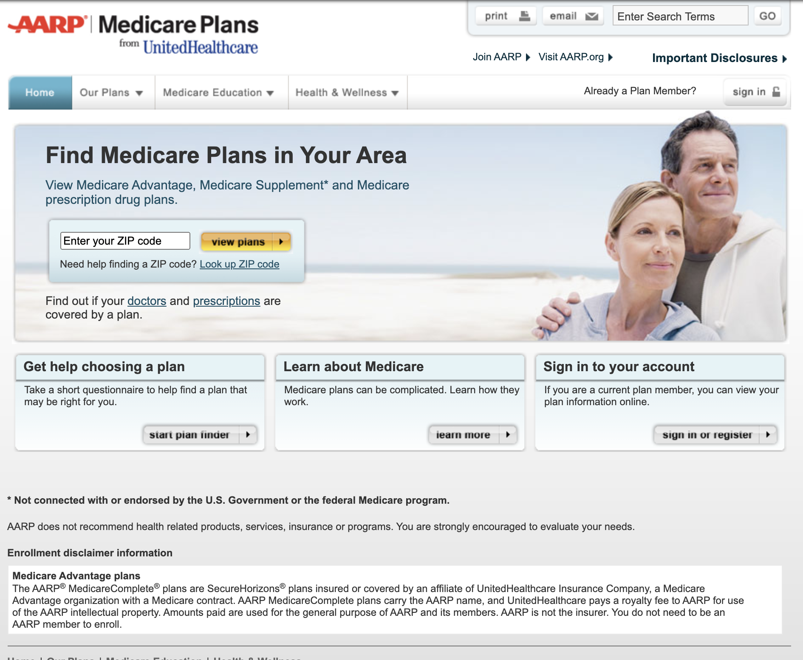

## Client: UnitedHealthcare Medicare & Retirement

#### Sr. Business Analyst - Online Marketing Sales & Acquisitions
Lead multiple Sales & Acquisition marketing projects on [AARPMedicarePlans.com]("https://www.aarpmedicareplans.com/") and [UHCMedicareSolutions.com]("https://www.uhcmedicaresolutions.com").

#### Projects
- Campaign tracking of all sales outcomes (leads/apps) from the web, telesales, and insurance (field) agents.
- Delivered customizable landing page system with A/B optimization testing.
- Medicare Recommendation Engine to suggest the best plans based on individual consumer preferences.
- Online Search optimization efforts – including SEO and SEM (paid search, display & retargeting ads).
- Live Chat with CRM integration, online RSVP for consumers interested in meeting with an insurance agent.
- Helped create [MedicareMadeClear.com]("https://www.medicaremadeclear.com/") + YouTube channel to educate consumers about their Medicare options.

<!-- Image -->

